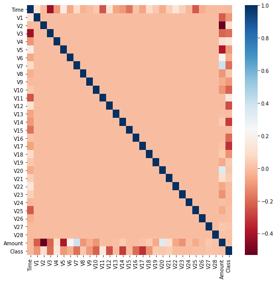
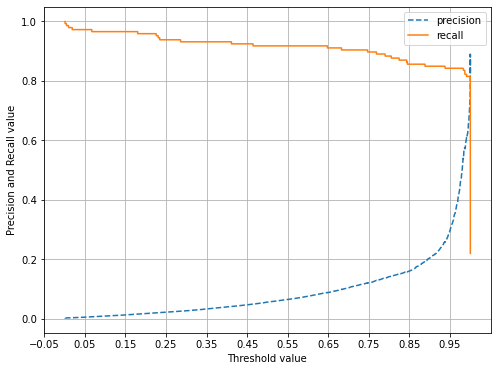

---
layout: post
title: 신용카드 사기검출
---


## 신용카드 사기검출

2021-01-18

data출처 : https://www.kaggle.com/mlg-ulb/creditcardfraud?select=creditcard.csv


```python
import pandas as pd
import numpy as np
import matplotlib.pyplot as plt
import warnings
warnings.filterwarnings("ignore")
%matplotlib inline

```

 ## 1. 데이터 로드
 
 * dataset을 DataFrame으로 변환한다
 * Class는 사기여부( 1: 사기케이스)


```python
card_df = pd.read_csv("./creditcard.csv")
card_df.head()
```


<div>
<style scoped>
    .dataframe tbody tr th:only-of-type {
        vertical-align: middle;
    }

    .dataframe tbody tr th {
        vertical-align: top;
    }

    .dataframe thead th {
        text-align: right;
    }
</style>
<table border="1" class="dataframe">
  <thead>
    <tr style="text-align: right;">
      <th></th>
      <th>Time</th>
      <th>V1</th>
      <th>V2</th>
      <th>V3</th>
      <th>V4</th>
      <th>V5</th>
      <th>V6</th>
      <th>V7</th>
      <th>V8</th>
      <th>V9</th>
      <th>...</th>
      <th>V21</th>
      <th>V22</th>
      <th>V23</th>
      <th>V24</th>
      <th>V25</th>
      <th>V26</th>
      <th>V27</th>
      <th>V28</th>
      <th>Amount</th>
      <th>Class</th>
    </tr>
  </thead>
  <tbody>
    <tr>
      <th>0</th>
      <td>0.0</td>
      <td>-1.359807</td>
      <td>-0.072781</td>
      <td>2.536347</td>
      <td>1.378155</td>
      <td>-0.338321</td>
      <td>0.462388</td>
      <td>0.239599</td>
      <td>0.098698</td>
      <td>0.363787</td>
      <td>...</td>
      <td>-0.018307</td>
      <td>0.277838</td>
      <td>-0.110474</td>
      <td>0.066928</td>
      <td>0.128539</td>
      <td>-0.189115</td>
      <td>0.133558</td>
      <td>-0.021053</td>
      <td>149.62</td>
      <td>0</td>
    </tr>
    <tr>
      <th>1</th>
      <td>0.0</td>
      <td>1.191857</td>
      <td>0.266151</td>
      <td>0.166480</td>
      <td>0.448154</td>
      <td>0.060018</td>
      <td>-0.082361</td>
      <td>-0.078803</td>
      <td>0.085102</td>
      <td>-0.255425</td>
      <td>...</td>
      <td>-0.225775</td>
      <td>-0.638672</td>
      <td>0.101288</td>
      <td>-0.339846</td>
      <td>0.167170</td>
      <td>0.125895</td>
      <td>-0.008983</td>
      <td>0.014724</td>
      <td>2.69</td>
      <td>0</td>
    </tr>
    <tr>
      <th>2</th>
      <td>1.0</td>
      <td>-1.358354</td>
      <td>-1.340163</td>
      <td>1.773209</td>
      <td>0.379780</td>
      <td>-0.503198</td>
      <td>1.800499</td>
      <td>0.791461</td>
      <td>0.247676</td>
      <td>-1.514654</td>
      <td>...</td>
      <td>0.247998</td>
      <td>0.771679</td>
      <td>0.909412</td>
      <td>-0.689281</td>
      <td>-0.327642</td>
      <td>-0.139097</td>
      <td>-0.055353</td>
      <td>-0.059752</td>
      <td>378.66</td>
      <td>0</td>
    </tr>
    <tr>
      <th>3</th>
      <td>1.0</td>
      <td>-0.966272</td>
      <td>-0.185226</td>
      <td>1.792993</td>
      <td>-0.863291</td>
      <td>-0.010309</td>
      <td>1.247203</td>
      <td>0.237609</td>
      <td>0.377436</td>
      <td>-1.387024</td>
      <td>...</td>
      <td>-0.108300</td>
      <td>0.005274</td>
      <td>-0.190321</td>
      <td>-1.175575</td>
      <td>0.647376</td>
      <td>-0.221929</td>
      <td>0.062723</td>
      <td>0.061458</td>
      <td>123.50</td>
      <td>0</td>
    </tr>
    <tr>
      <th>4</th>
      <td>2.0</td>
      <td>-1.158233</td>
      <td>0.877737</td>
      <td>1.548718</td>
      <td>0.403034</td>
      <td>-0.407193</td>
      <td>0.095921</td>
      <td>0.592941</td>
      <td>-0.270533</td>
      <td>0.817739</td>
      <td>...</td>
      <td>-0.009431</td>
      <td>0.798278</td>
      <td>-0.137458</td>
      <td>0.141267</td>
      <td>-0.206010</td>
      <td>0.502292</td>
      <td>0.219422</td>
      <td>0.215153</td>
      <td>69.99</td>
      <td>0</td>
    </tr>
  </tbody>
</table>
<p>5 rows × 31 columns</p>
</div>


```python
card_df.info()
card_df.shape
```

    <class 'pandas.core.frame.DataFrame'>
    RangeIndex: 284807 entries, 0 to 284806
    Data columns (total 31 columns):
     #   Column  Non-Null Count   Dtype  
    ---  ------  --------------   -----  
     0   Time    284807 non-null  float64
     1   V1      284807 non-null  float64
     2   V2      284807 non-null  float64
     3   V3      284807 non-null  float64
     4   V4      284807 non-null  float64
     5   V5      284807 non-null  float64
     6   V6      284807 non-null  float64
     7   V7      284807 non-null  float64
     8   V8      284807 non-null  float64
     9   V9      284807 non-null  float64
     10  V10     284807 non-null  float64
     11  V11     284807 non-null  float64
     12  V12     284807 non-null  float64
     13  V13     284807 non-null  float64
     14  V14     284807 non-null  float64
     15  V15     284807 non-null  float64
     16  V16     284807 non-null  float64
     17  V17     284807 non-null  float64
     18  V18     284807 non-null  float64
     19  V19     284807 non-null  float64
     20  V20     284807 non-null  float64
     21  V21     284807 non-null  float64
     22  V22     284807 non-null  float64
     23  V23     284807 non-null  float64
     24  V24     284807 non-null  float64
     25  V25     284807 non-null  float64
     26  V26     284807 non-null  float64
     27  V27     284807 non-null  float64
     28  V28     284807 non-null  float64
     29  Amount  284807 non-null  float64
     30  Class   284807 non-null  int64  
    dtypes: float64(30), int64(1)
    memory usage: 67.4 MB
    


    (284807, 31)


총 31개의 column으로 이루어져 있고 데이터 타입은 전부 숫자형이다.

entry는 전부 284807개로 missing value는 없음을 알 수 있다.

## 2. 데이터 전처리

원본 DataFrame과는 별도로 가공을 위한 DataFrame울 복사해 가공한다.


```python
#Time피처는 큰 의미가 없는 피처여서 drop
def get_preprocessed_df(df=None):
    df_copy = df.copy()
    df_copy.drop('Time', axis=1, inplace=True)
    return df_copy
```

* train_test_split의 기능을 하는 함수를 별도로 만든다.

* 이렇게 하는 이유는 log변환, SMOTE등을 적용하는 과정에서 원본 dataframe을 손상시키지 않기 위해 복사본이 필요하기 때문


```python
from sklearn.model_selection import train_test_split

def get_train_test_dataset(df = None):
    ch_df = get_preprocessed_df(df)
    X_features = ch_df.iloc[:,:-1]
    y_target =ch_df.iloc[:,-1]
    
    X_train, X_test, y_train, y_test = train_test_split(
        X_features, y_target, test_size = 0.3, random_state = 10, stratify=y_target)
    
    return X_train, X_test, y_train, y_test


X_train, X_test, y_train, y_test = get_train_test_dataset(card_df)
```

* 분할이 골고루 됐는지 비율을 구해서 확인 (label 값만 확인하면 됨)


```python
print("train dataset 분할 비율: ")
print(y_train.value_counts()/y_train.shape[0])

print("train dataset 분할 비율: ")
print(y_test.value_counts()/y_test.shape[0])
```

    train dataset 분할 비율: 
    0    0.998275
    1    0.001725
    Name: Class, dtype: float64
    train dataset 분할 비율: 
    0    0.998268
    1    0.001732
    Name: Class, dtype: float64
    


```python
from sklearn.metrics import confusion_matrix, accuracy_score, precision_score, recall_score, f1_score
from sklearn.metrics import roc_auc_score

# 수정된 get_clf_eval() 함수 
def get_clf_eval(y_test, pred=None, pred_proba=None):
    confusion = confusion_matrix( y_test, pred)
    accuracy = accuracy_score(y_test , pred)
    precision = precision_score(y_test , pred)
    recall = recall_score(y_test , pred)
    f1 = f1_score(y_test,pred)
    # ROC-AUC 추가 
    roc_auc = roc_auc_score(y_test, pred_proba)
    print('오차 행렬')
    print(confusion)
    # ROC-AUC print 추가
    print('정확도: {0:.4f}, 정밀도: {1:.4f}, 재현율: {2:.4f},\
    F1: {3:.4f}, AUC:{4:.4f}'.format(accuracy, precision, recall, f1, roc_auc))
```

## 3. 학습


```python
#학습의 과정을 함수화해서 여러가지 학습 방법을 사용할떄 유리하도록 한다.

def model_fit_predict(model, ftr_train=None, ftr_test=None, tgt_train=None, tgt_test=None):
    #학습 수행
    model.fit(ftr_train, tgt_train)
    #예측
    pred = model.predict(ftr_test)
    #1일 확률, 사기일 경우만 슬라이싱해서 predict proba로 구함
    pred_proba = model.predict_proba(ftr_test)[:,1]
    
    get_clf_eval(tgt_test, pred, pred_proba) 
```

* LogisticRegression으로 학습


```python
from sklearn.linear_model import LogisticRegression

lr_clf = LogisticRegression()
model_fit_predict(lr_clf, ftr_train = X_train, ftr_test= X_test, tgt_train= y_train, tgt_test=y_test)

from lightgbm import LGBMClassifier

lgbm_clf = LGBMClassifier(n_estimators= 1000, num_leaves=64, n_jobs=-1, boost_from_average = False)
model_fit_predict(lgbm_clf, ftr_train = X_train, ftr_test= X_test, tgt_train= y_train, tgt_test=y_test)

```

    오차 행렬
    [[85282    13]
     [   57    91]]
    정확도: 0.9992, 정밀도: 0.8750, 재현율: 0.6149,    F1: 0.7222, AUC:0.9443
    오차 행렬
    [[85289     6]
     [   28   120]]
    정확도: 0.9996, 정밀도: 0.9524, 재현율: 0.8108,    F1: 0.8759, AUC:0.9772
    

## 4. 중요 피처 분포도 확인

* 'Amount' 피처 : 카드결제 금액


```python
import seaborn as sns

plt.figure(figsize=(10,5))
plt.xticks(range(0,30000,1000), rotation=70)
sns.distplot(card_df['Amount'])
```


    


결제 금액이 대부분 500 미만이고 불균형한 분포를 가짐을 확인할 수 있다.

정확한 비교를 위해 Standard Scaler을 이용해 정규분포로 바꿔준다


```python
from sklearn.preprocessing import StandardScaler

#위에서 작성한 get_preprocessed_df함수 새로 작성
def get_preprocessed_df(df=None):
    df_copy = df.copy()
    scaler = StandardScaler()
    amount_n = scaler.fit_transform(df_copy['Amount'].values.reshape(-1, 1))
    
    # 변환된 Amount를 Amount_Scaled로 피처명 변경후 DataFrame맨 앞 컬럼으로 입력
    df_copy.insert(0, 'Amount_Scaled', amount_n)
    
    # 기존 Time, Amount 피처 삭제
    df_copy.drop(['Time','Amount'], axis=1, inplace=True)
    return df_copy
```

## 5. 'Amount'피처 스케일링 후 학습/예측


```python
X_train, X_test, y_train,y_test = get_train_test_dataset(card_df)

print("로지스틱 회귀 성능 :")
lr_clf = LogisticRegression()
model_fit_predict(lr_clf, ftr_train = X_train, ftr_test= X_test, tgt_train= y_train, tgt_test=y_test)
print("lightGBM 회귀 성능 :")
lgbm_clf = LGBMClassifier(n_estimators= 1000, num_leaves=64, n_jobs=-1, boost_from_average = False)
model_fit_predict(lgbm_clf, ftr_train = X_train, ftr_test= X_test, tgt_train= y_train, tgt_test=y_test)


```

    로지스틱 회귀 성능 :
    오차 행렬
    [[85285    10]
     [   63    85]]
    정확도: 0.9991, 정밀도: 0.8947, 재현율: 0.5743,    F1: 0.6996, AUC:0.9840
    lightGBM 회귀 성능 :
    오차 행렬
    [[85289     6]
     [   27   121]]
    정확도: 0.9996, 정밀도: 0.9528, 재현율: 0.8176,    F1: 0.8800, AUC:0.9830
    

* Amount를 로그변환


```python
def get_preprocessed_df(df=None):
    df_copy = df.copy()
    # 넘파이의 log1p( )를 이용하여 Amount를 로그 변환 
    #
    amount_n = np.log1p(df_copy['Amount'])
    df_copy.insert(0, 'Amount_Scaled', amount_n)
    df_copy.drop(['Time','Amount'], axis=1, inplace=True)
    return df_copy
```


```python
X_train, X_test, y_train,y_test = get_train_test_dataset(card_df)

print("로지스틱 회귀 성능 :")
lr_clf = LogisticRegression()
model_fit_predict(lr_clf, ftr_train = X_train, ftr_test= X_test, tgt_train= y_train, tgt_test=y_test)
print("lightGBM 회귀 성능 :")
lgbm_clf = LGBMClassifier(n_estimators= 1000, num_leaves=64, n_jobs=-1, boost_from_average = False)
model_fit_predict(lgbm_clf, ftr_train = X_train, ftr_test= X_test, tgt_train= y_train, tgt_test=y_test)


```

    로지스틱 회귀 성능 :
    오차 행렬
    [[85285    10]
     [   62    86]]
    정확도: 0.9992, 정밀도: 0.8958, 재현율: 0.5811,    F1: 0.7049, AUC:0.9807
    lightGBM 회귀 성능 :
    오차 행렬
    [[85289     6]
     [   28   120]]
    정확도: 0.9996, 정밀도: 0.9524, 재현율: 0.8108,    F1: 0.8759, AUC:0.9761
    

## 6. 이상치 제거후 학습/예측

결정 레이블값과 가장 상관도가 높은 피처 추출


```python
import seaborn as sns

plt.figure(figsize=(9, 9))
#각각의 칼럼들끼리의 상관도 인자로 전달
corr = card_df.corr()
sns.heatmap(corr, cmap='RdBu') #cmap = 칼라맵
```


    <AxesSubplot:>


    

    


'Class'값과 가장 관련이 있는 피처 : V14


```python
def get_outlier(df=None, column=None, weight=1.5):
    # fraud에 해당하는 column 데이터만 추출, 1/4 분위와 3/4 분위 지점을 np.percentile로 구함. 
    fraud = df[df['Class']==1][column]
    quantile_25 = np.percentile(fraud.values, 25)
    quantile_75 = np.percentile(fraud.values, 75)
    
    # IQR을 구하고, IQR에 1.5를 곱하여 최대값과 최소값 지점 구함. 
    iqr = quantile_75 - quantile_25
    iqr_weight = iqr * weight
    lowest_val = quantile_25 - iqr_weight
    highest_val = quantile_75 + iqr_weight
    
    # 최대값 보다 크거나, 최소값 보다 작은 값을 아웃라이어로 설정하고 DataFrame index 반환. 
    outlier_index = fraud[(fraud < lowest_val) | (fraud > highest_val)].index
    
    return outlier_index
```


```python
outlier_index = get_outlier(df=card_df, column='V14', weight=1.5)
print('이상치 데이터 인덱스:', outlier_index)
```

    이상치 데이터 인덱스: Int64Index([8296, 8615, 9035, 9252], dtype='int64')
    

* Amount 값 로그 변환 후 V14 피터의 Outlier제거하는 함수 get_preprocessed_df 새로 작성


```python
def get_preprocessed_df(df=None):
    df_copy = df.copy()
    amount_n = np.log1p(df_copy['Amount'])
    df_copy.insert(0, 'Amount_Scaled', amount_n)
    df_copy.drop(['Time','Amount'], axis=1, inplace=True)
    
    # 이상치 데이터 삭제하는 로직 추가
    outlier_index = get_outlier(df=df_copy, column='V14', weight=1.5)
    df_copy.drop(outlier_index, axis=0, inplace=True)
    return df_copy

X_train, X_test, y_train, y_test = get_train_test_dataset(card_df)

print('로지스틱 회귀 예측:')
model_fit_predict(lr_clf, ftr_train=X_train, ftr_test=X_test, tgt_train=y_train, tgt_test=y_test)

print('LightGBM 예측:')
model_fit_predict(lgbm_clf, ftr_train=X_train, ftr_test=X_test, tgt_train=y_train, tgt_test=y_test)

```

    로지스틱 회귀 예측:
    오차 행렬
    [[85284    11]
     [   57    89]]
    정확도: 0.9992, 정밀도: 0.8900, 재현율: 0.6096,    F1: 0.7236, AUC:0.9748
    LightGBM 예측:
    오차 행렬
    [[85293     2]
     [   31   115]]
    정확도: 0.9996, 정밀도: 0.9829, 재현율: 0.7877,    F1: 0.8745, AUC:0.9815
    

* 이상치 제거후 로지스틱 회귀의 경우 재현율이 상당히 증가함을 알 수 있다.

= FN 값이 줄어들었다고 볼 수 있는데 신용카드 사기와 같이 사기가 아니라고 예측했다 틀리는 경우가 적어야 되는 케이스에서는 재현율이 성능을 보여주는 중요한 지표가 될 수 있다.

## 7. SMOTE 오버 샘플링 적용 후 학습/예측


```python
from imblearn.over_sampling import SMOTE

smote = SMOTE(random_state=0)
X_train_over , y_train_over = smote.fit_sample(X_train, y_train)
```


```python
print("SMOTE 전", X_train.shape, y_train.shape)
print("SMOTE 후", X_train_over.shape, y_train_over.shape)
print("SMOTE 후 레이블 값 분포\n",pd.Series(y_train_over).value_counts())
```

    SMOTE 전 (199362, 29) (199362,)
    SMOTE 후 (398040, 29) (398040,)
    SMOTE 후 레이블 값 분포
     1    199020
    0    199020
    Name: Class, dtype: int64
    

* 적용후 데이터 값이 거의 두배 증식됐음을 확인할 수 있다.


```python
print('오버 샘플링 후 로지스틱 회귀 예측:')
model_fit_predict(lr_clf, ftr_train=X_train_over, ftr_test=X_test, tgt_train=y_train_over, tgt_test=y_test)

print('오버 샘플링 후 LightGBM 예측:')
model_fit_predict(lgbm_clf, ftr_train=X_train_over, ftr_test=X_test, tgt_train=y_train_over, tgt_test=y_test)
 
```

    오버 샘플링 후 로지스틱 회귀 예측:
    오차 행렬
    [[82994  2301]
     [   12   134]]
    정확도: 0.9729, 정밀도: 0.0550, 재현율: 0.9178,    F1: 0.1038, AUC:0.9711
    오버 샘플링 후 LightGBM 예측:
    오차 행렬
    [[85271    24]
     [   29   117]]
    정확도: 0.9994, 정밀도: 0.8298, 재현율: 0.8014,    F1: 0.8153, AUC:0.9562
    

* smote후 로지스틱 회귀의 경우, 제현울은 좋지만 정밀도가 너무 낮아 부적합한 모델이 됨

## 8. Precision Recall 곡선 시각화


```python
import matplotlib.pyplot as plt
import matplotlib.ticker as ticker
from sklearn.metrics import precision_recall_curve
%matplotlib inline

def precision_recall_curve_plot(y_test , pred_proba_c1):
    # threshold ndarray와 이 threshold에 따른 정밀도, 재현율 ndarray 추출. 
    precisions, recalls, thresholds = precision_recall_curve( y_test, pred_proba_c1)
    
    # X축을 threshold값으로, Y축은 정밀도, 재현율 값으로 각각 Plot 수행. 정밀도는 점선으로 표시
    plt.figure(figsize=(8,6))
    threshold_boundary = thresholds.shape[0]
    plt.plot(thresholds, precisions[0:threshold_boundary], linestyle='--', label='precision')
    plt.plot(thresholds, recalls[0:threshold_boundary],label='recall')
    
    # threshold 값 X 축의 Scale을 0.1 단위로 변경
    start, end = plt.xlim()
    plt.xticks(np.round(np.arange(start, end, 0.1),2))
    
    # x축, y축 label과 legend, 그리고 grid 설정
    plt.xlabel('Threshold value'); plt.ylabel('Precision and Recall value')
    plt.legend(); plt.grid()
    plt.show()
    

```


```python
precision_recall_curve_plot( y_test, lr_clf.predict_proba(X_test)[:, 1] )
```


    

    


```python

```


|데이터 가공 유형|머신러닝 알고리즘|정밀도|재현율|ROC-AUC|
|---|---|---|---|---|
|원본 데이터 가공 없음   |   |   |   |   |   
|   |   |   |   |   |   
|데이터 로그 변환 |    |   |   |   |
|   |   |   |   |      |
|이상치 데이터 제거   |    |   |   |   |
|   |   |   |   |   |
|SMOTE 오버 샘플링   |      |   |   |   |
|   |   |   |   |   |
